# A1-1 Python & Git 기초
## 1. 프로젝트 소개:나만의 프롬프트 관리 프로그램  
+ ### 프로젝트 목적  
  \- GenAI를 학습하면서 다양한 생성형 AI 프롬프트가 쌓이게 되었고, 필요한 프롬프트를 쉽게 찾고 관리할 수 있는 프로그램의 필요성을 느낌  
  \- 이 프로젝트에서는 Python의 기본 문법과 자료구조를 활용하여 프롬프트를 저장하고 조회할 수 있는 콘솔 기반 관리 프로그램을 구현  
  \- 또한 Git과 Github를 활용하여 기능별로 코드를 관리하고 변경 이력을 기록함  

+ ### 프로젝트 특징  
  \- Python 콘솔 기반 프로그램  
  \- 리스트와 딕셔너리를 활용한 데이터 관리  
  \- 기능별 함수 분리  
  \- 카테고리별 프롬프트 관리  
  \- 키워드 관리  
  \- 즐겨찾기 관리  
  \- JSON을 활용한 데이터 영속화  
  \- Markdown 파일 내보내기  
  \- Git 브랜치를 활용한 기능별 개발 및 병합

- - -

## 2. 개발 환경  
+ ### 개발 환경 설정  

  

| 항목 | 내용 |  
| :---: | :---: |
| 언어 | Python 3.14.6 |
| 개발 도구 | Visual Studio Code |
| 버전 관리 | Git |
| 원격 저장소 | GitHub |
| 데이터 저장 | JSON |
| 파일 내보내기 | Markdown |

- - -

## 3. 실행 방법  

### GitHub 저장소

[GitHub Repository](https://github.com/codyssey-siyul/A1-1)

### 1) 저장소 Clone

```text

git clone https://github.com/codyssey-siyul/A1-1.git

```

### 2) 프로젝트 폴더 이동  

```text

cd A1-1

```

### 3) 프로그램 실행  

```text

python main.py

```

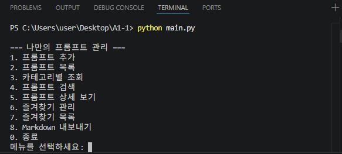  

\- 프로그램 실행 후 메뉴 번호를 입력하여 원하는 기능을 선택

- - -

## 4. 프롬프트 카테고리  

| 카테고리 | 설명 |
| :---: | :---: |
| 텍스트 생성 | 글 작성, 요약, 아이디어 생성 등 텍스트 기반 작업에 사용하는 프롬프트 |
| 이미지 생성 | 이미지 생성 AI를 활용하여 원하는 이미지를 만들기 위한 프롬프트 |
| 영상 생성 | 영상 제작 및 영상 생성 AI에 활용하기 위한 프롬프트 |
| 페르소나 | AI에게 특정 역할이나 전문성을 부여하기 위한 프롬프트 |
| 자동화 | 반복 작업이나 AI 자동화에 활용하기 위한 프롬프트 |
| 기타 | 위 카테고리에 포함되지 않는 프롬프트 |

- - -

## 5. 주요 기능 및 실행 결과

### 1) 프롬프트 추가  

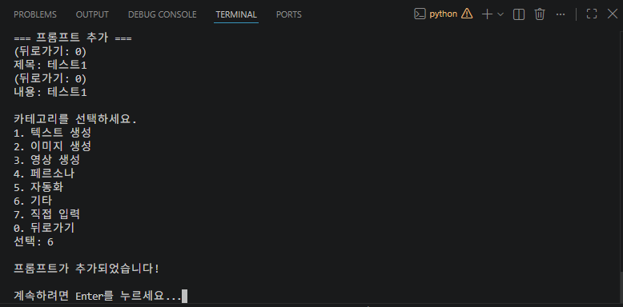  
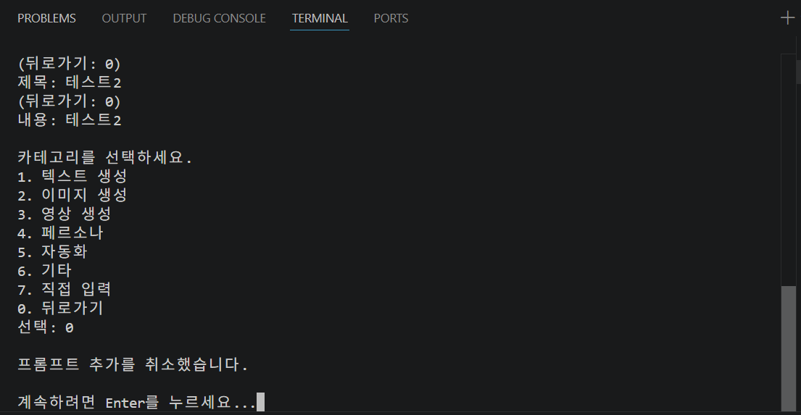  

\- 제목, 내용, 카테고리를 입력하여 새로운 프롬프트를 등록  
\- 입력값이 비어있는 경우 다시 입력하도록 처리했으며, 추가 과정에서 0을 입력하면 작업을 취소하고 이전 메뉴로 돌아갈 수 있도록 구현  


### 2) 프롬프트 목록

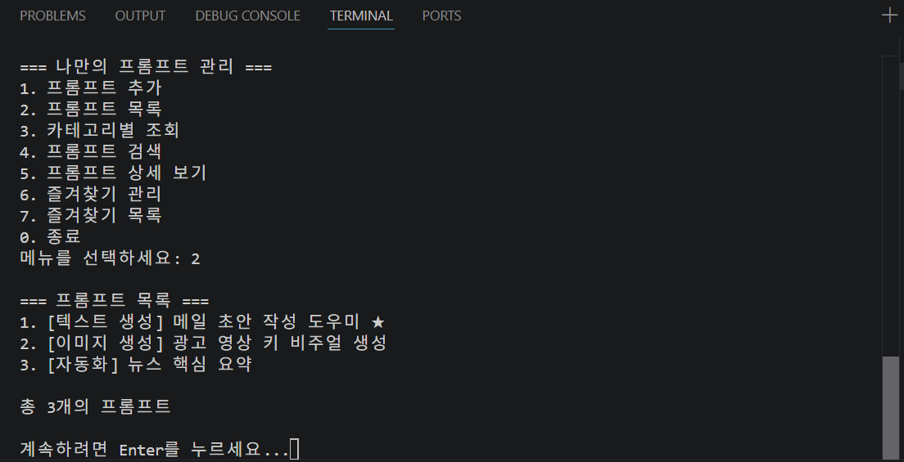  

\- 저장된 모든 프롬프트를 번호와 함께 출력  
\- 각 프롬프트의 제목, 카테고리, 즐겨찾기 여부를 확인할 수 있으며 즐겨찾기된 프롬프트는 ⭐로 표시  


### 3) 카테고리별 조회

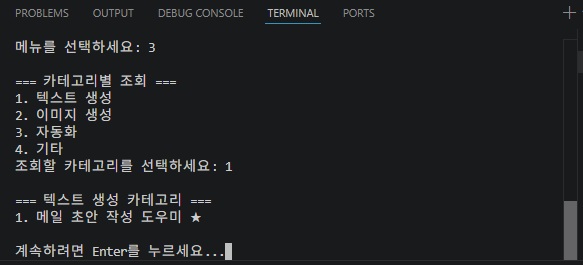  

\- 카테고리를 선택하면 해당 카테고리에 등록된 프롬프트만 조회 가능  
\- 해당 카테고리에 프롬프트가 없는 경우 안내 메시지 출력  


### 4) 프롬프트 검색

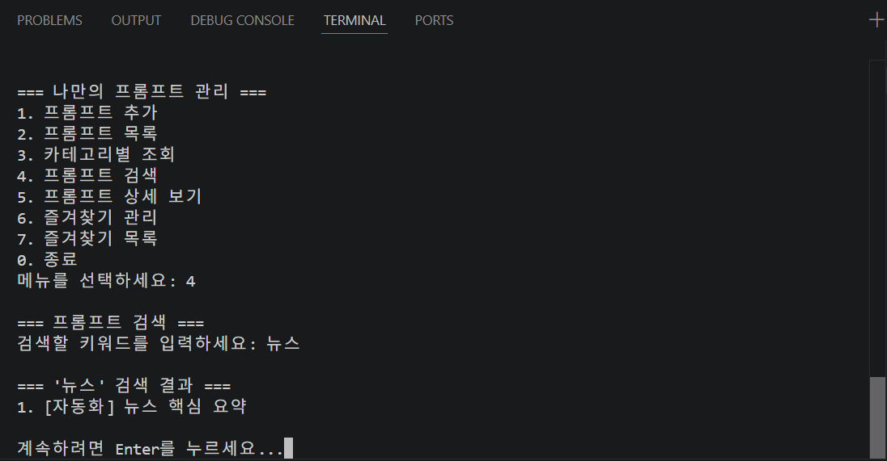  
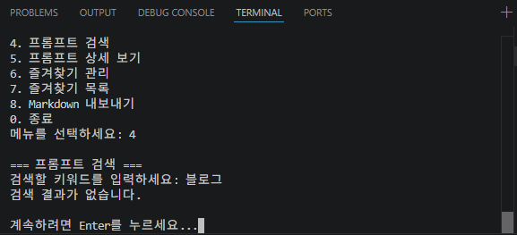  

\- 검색어를 입력하면 프롬프트의 제목 또는 내용에 해당 키워드가 포함되어 있는지 확인하여 검색 결과 출력  
\- 검색 결과가 없는 경우에도 별도의 안내 메시지 출력  


### 5) 프롬프트 상세 보기

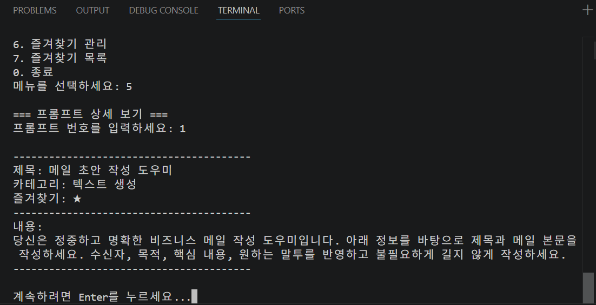  
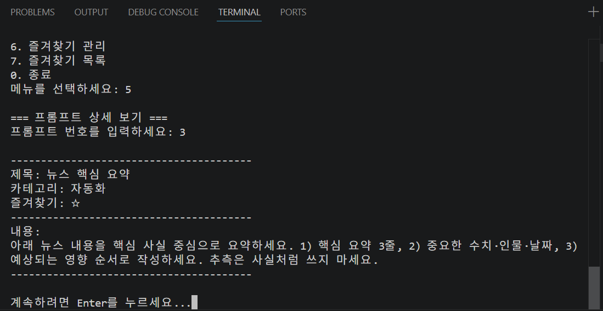  
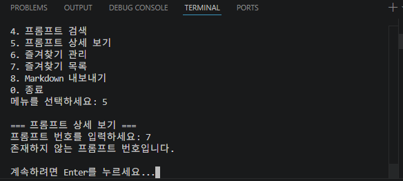  

\- 프롬프트 번호를 입력하면 해당 프롬프트의 상세 정보를 확인  
```text
- 제목
- 카테고리
- 즐겨찾기 여부
- 프롬프트 전체 내용
```
\- 잘못된 번호를 입력한 경우 안내 메시지 출력  


### 6) 즐겨찾기 관리 및 목록

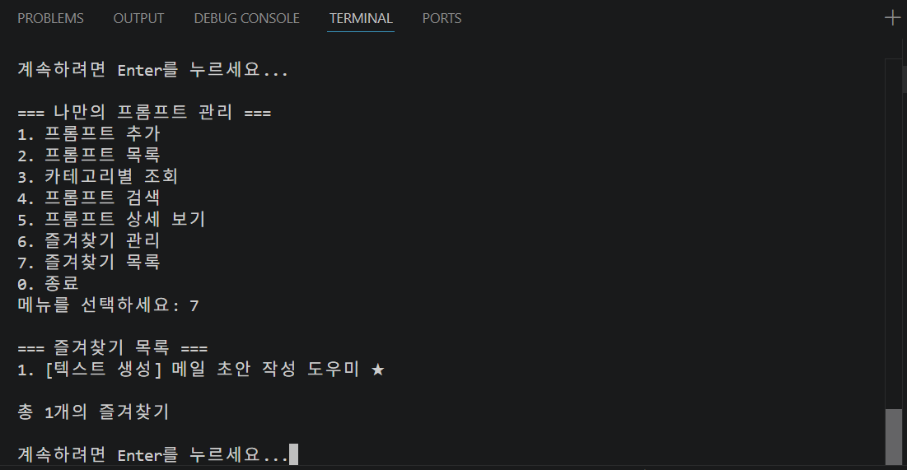  
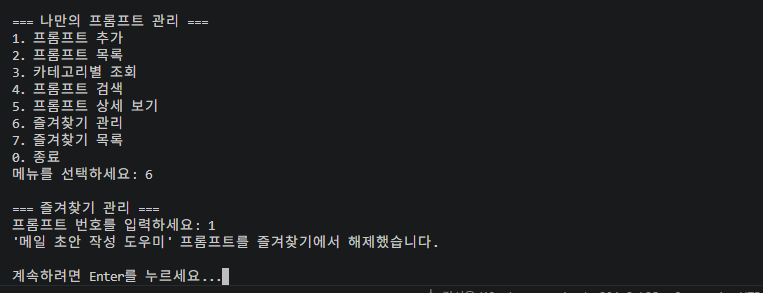  

\- 자주 사용하는 프롬프트를 즐겨찾기에 추가하거나 해제  
\- 즐겨찾기된 프롬프트는 목록에서 ⭐로 표시되며, 즐겨찾기 목록을 통해 해당 프롬프트만 모아서 확인  


### 7) 보너스 과제: 프롬프트 영속화 및 내보내기  

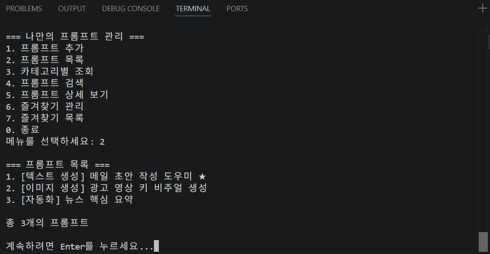  
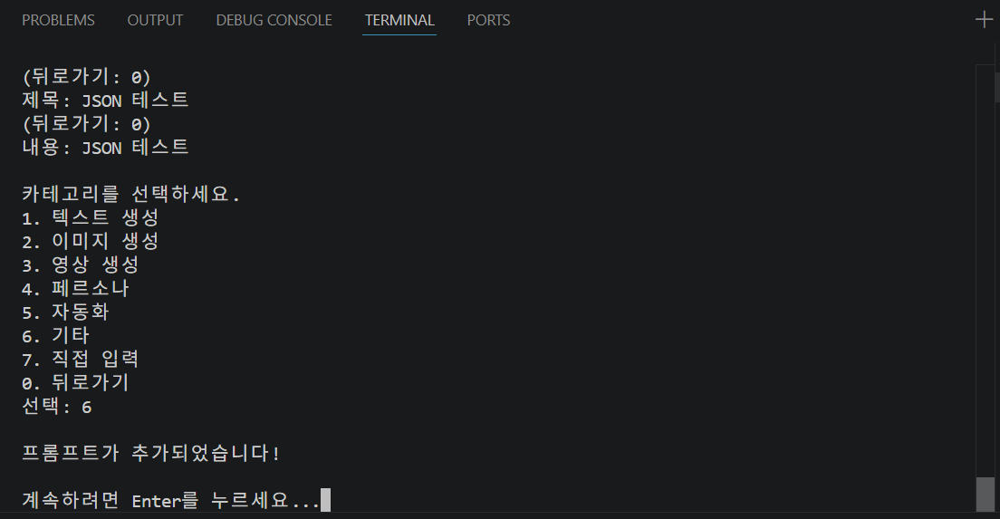  
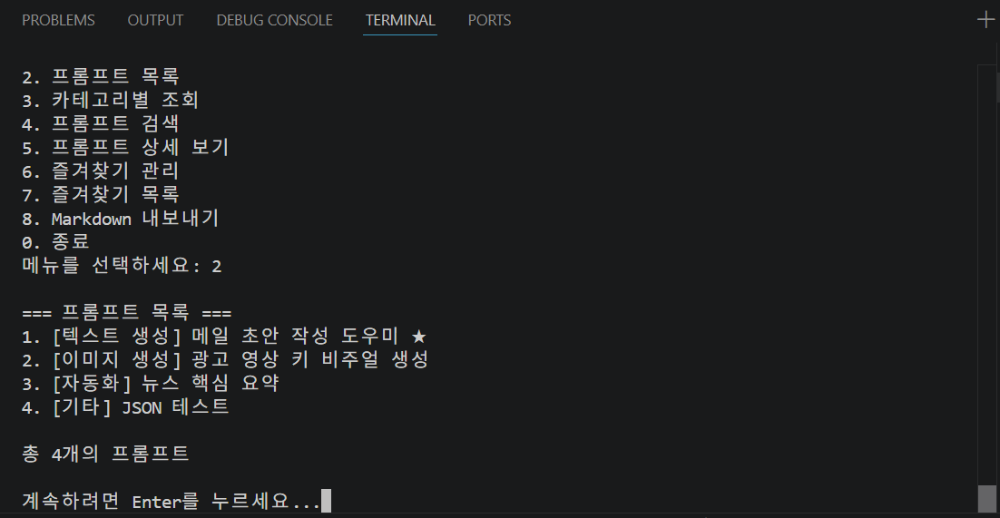  

\- 프로그램 실행 시 prompts.json 파일에 저장된 데이터를 자동으로 불러오고, 프로그램 종료 시 현재 프롬프트 데이터를 자동으로 저장하도록 구현  
\- 이를 통해 프로그램을 종료한 후 다시 실행해도 기존 프롬프트와 즐겨찾기 상태를 유지  

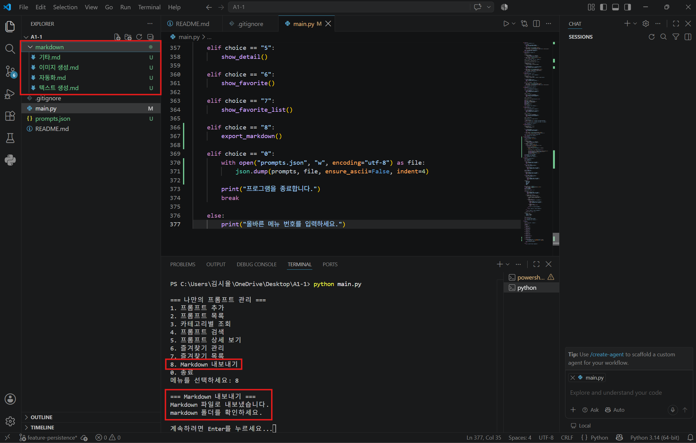  

\- 저장된 프롬프트를 카테고리별 Markdown 파일로 내보내기  
\- 내보낸 Markdown 파일은 markdown/ 폴더에 저장되도록 구현  


### 8) 코드 구조 및 Git  

+ ### 코드 구조
 \- 기능 별로 함수를 분리하여 코드의 가독성과 유지 보수성을 높임  
| 함수 | 기능 |
| --- | --- |
| `show_menu()` | 메인 메뉴 출력 및 기능 선택 |
| `add_prompt()` | 새로운 프롬프트 추가 |
| `show_list()` | 전체 프롬프트 목록 출력 |
| `search_prompt()` | 키워드를 이용한 프롬프트 검색 |
| `show_favorites()` | 즐겨찾기 프롬프트 목록 출력 |

+ ### Git 작업 기록

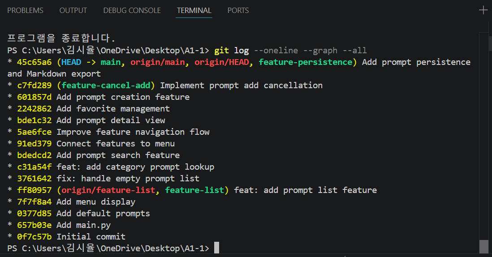  

\- 기능별로 브랜치를 생성하여 독립적으로 개발하고, 각 기능이 완성될 때마다 의미 있는 단위로 커밋하여 변경 이력 기록  
\- 기능 개발이 완료된 후에는 main 브랜치에 병합하여 브랜치 생성부터 병합까지의 Git 작업 과정을 직접 경험하고 프로젝트의 변경 이력을 체계적으로 관리  

+ ### 주요 브랜치  
| 브랜치 | 작업 내용 |  
| :---: | :---: |
| feature-list | 프롬프트 목록 기능 |
| feature-cancel-add | 프롬프트 추가 취소 기능 |
| feature-persistence | JSON 저장 및 불러오기 기능 |

+ ### 주요 Git 명령어  
| 명령어 | 설명 |
| :---: | :---: |
| git init | 현재 폴더를 Git 저장소로 **처음 설정**한다 |
| git clone | Github에 있는 저장소를 **내 컴퓨터로 복사**한다 |
| git add | 수정하거나 새로 만든 파일을 **커밋 준비 상태로 등록**한다 |
| git commit | 변경 내용을 **하나의 작업 기록으로 저장**한다 |
| git push | 내 컴퓨터의 커밋 내용을 **Github 원격 저장소에 업로드**한다 |
| git pull | Github의 최신 변경 내용을 **내 컴퓨터로 가져온다** |
| git checkout | **브랜치를 전환**하거나 특정 상태의 파일을 가져온다 |
| git merge | 다른 브랜치에서 작업한 내용을 **현재 브랜치에 합친다** |
