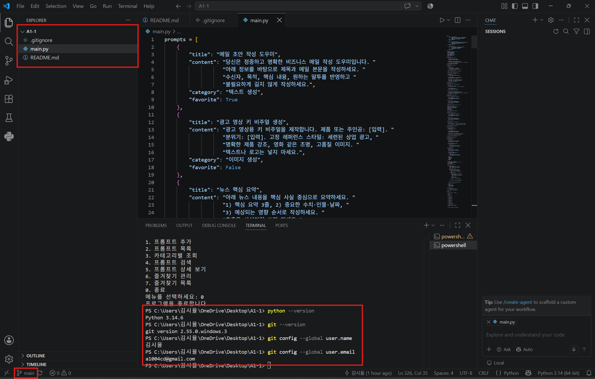

# A1-1 Python & Git 기초
## 1. 프로젝트 소개:나만의 프롬프트 관리 프로그램  
+ ### 프로젝트 목적  
  \- GenAI를 학습하면서 다양한 생성형 AI 프롬프트가 쌓이게 되었고, 필요한 프롬프트를 쉽게 찾고 관리할 수 있는 프로그램의 필요성을 느낌.  
  \- 이 프로젝트에서는 Python의 기본 문법과 자료구조를 활용하여 프롬프트를 저장하고 조회할 수 있는 콘솔 기반 관리 프로그램을 구현.  
  \- 또한 Git과 Github를 활용하여 기능별로 코드를 관리하고 변경 이력을 기록함.  

+ ### 프로젝트 특징  
  \- Python 콘솔 기반 프로그램  
  \- 리스트와 딕셔너리를 활용한 데이터 관리  
  \- 기능별 함수 분리  
  \- 카테고리별 프롬프트 관리  
  \- 키워드 관리  
  \- 즐겨찾기 관리  
  \- JSON을 활용한 데이터 영속화  
  \- Markdown 파일 내보내기  
  \- Git 브랜치를 활용한 기능별 개발 및 병합

- - -

## 2. 개발 환경  
+ ### 개발 환경 설정  

  

| 항목 | 내용 |  
| :---: | :---: |
| 언어 | Python 3.14.6 |
| 개발 도구 | Visual Studio Code |
| 버전 관리 | Git |
| 원격 저장소 | GitHub |
| 데이터 저장 | JSON |
| 파일 내보내기 | Markdown |

- - -

## 3. 프롬프트 카테고리  

| 카테고리 | 설명 |
| :---: | :---: |
| 텍스트 생성 | 글 작성, 요약, 아이디어 생성 등 텍스트 기반 작업에 사용하는 프롬프트 |
| 이미지 생성 | 이미지 생성 AI를 활용하여 원하는 이미지를 만들기 위한 프롬프트 |
| 영상 생성 | 영상 제작 및 영상 생성 AI에 활용하기 위한 프롬프트 |
| 페르소나 | AI에게 특정 역할이나 전문성을 부여하기 위한 프롬프트 |
| 자동화 | 반복 작업이나 AI 자동화에 활용하기 위한 프롬프트 |
| 기타 | 위 카테고리에 포함되지 않는 프롬프트 |
